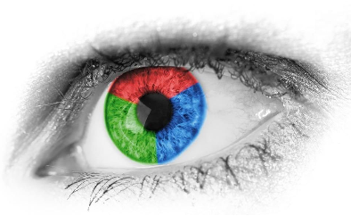

# If you have a large dev set, split it into two subsets, only one of which you look at
->

Suppose you have a large dev set of 5,000 examples in which you have a 20% error rate. Thus, your algorithm is misclassifying ~1,000 dev images. It takes a long time to manually examine 1,000 images, so we might decide not to use all of them in the error analysis.
->

In this case, I would explicitly split the dev set into two subsets, one of which you look at, and one of which you don’t. You will more rapidly overfit the portion that you are manually looking at. You can use the portion you are not manually looking at to tune parameters.
->

Let​’​s continue our example above, in which the algorithm is misclassifying 1,000 out of 5,000 dev set examples. Suppose we want to manually examine about 100 errors for error analysis (10% of the errors). You should randomly select 10% of the dev set and place that into what we’ll call an ​**Eyeball dev set**​ to remind ourselves that we are looking at it with our eyes. (For a project on speech recognition, in which you would be listening to audio clips, perhaps you would call this set an Ear dev set instead). The Eyeball dev set therefore has 500 examples, of which we would expect our algorithm to misclassify about 100.
->

The second subset of the dev set, called the **​Blackbox dev set​**, will have the remaining 4500 examples. You can use the Blackbox dev set to evaluate classifiers automatically by measuring their error rates. You can also use it to select among algorithms or tune hyperparameters. However, you should avoid looking at it with your eyes. We use the term “Blackbox” because we will only use this subset of the data to obtain “Blackbox” evaluations of classifiers.
->

Why do we explicitly separate the dev set into Eyeball and Blackbox dev sets? Since you will gain intuition about the examples in the Eyeball dev set, you will start to overfit the Eyeball dev set faster. If you see the performance on the Eyeball dev set improving much more rapidly than the performance on the Blackbox dev set, you have overfit the Eyeball dev set. In this case, you might need to discard it and find a new Eyeball dev set by moving more examples from the Blackbox dev set into the Eyeball dev set or by acquiring new labeled data.
->

Explicitly splitting your dev set into Eyeball and Blackbox dev sets allows you to tell when your manual error analysis process is causing you to overfit the Eyeball portion of your data.
->

