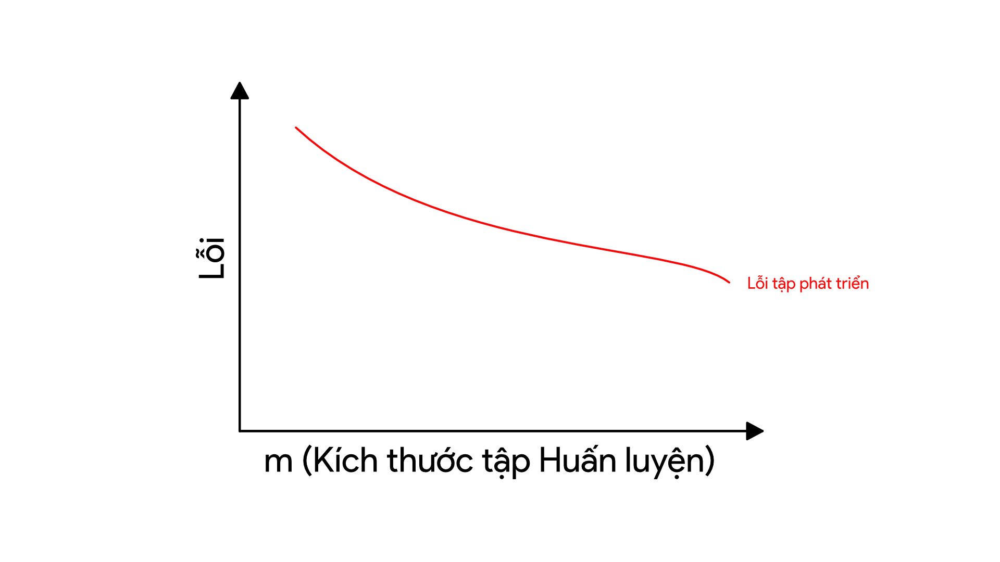
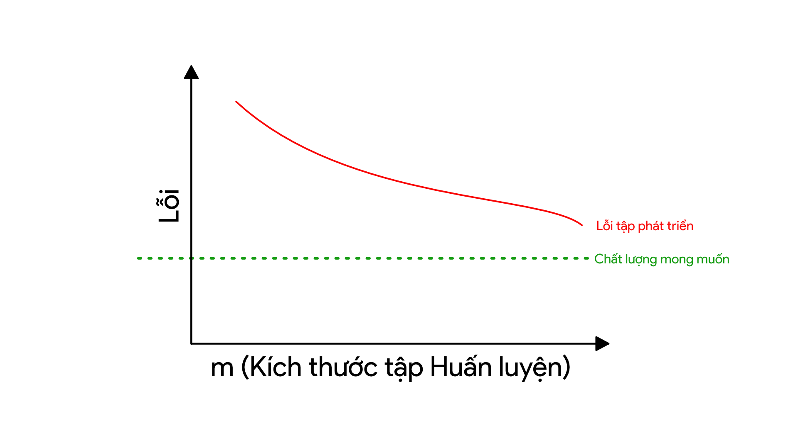

# Diagnosing bias and variance: Learning curves

->

We’ve seen some ways to estimate how much error can be attributed to avoidable bias vs. variance. We did so by estimating the optimal error rate and computing the algorithm’s training set and dev set errors. Let’s discuss a technique that is even more informative: plotting a learning curve.

->

A learning curve plots your dev set error against the number of training examples. To plot it, you would run your algorithm using different training set sizes. For example, if you have 1,000 examples, you might train separate copies of the algorithm on 100, 200, 300, ..., 1000 examples. Then you could plot how dev set error varies with the training set size. Here is an example:

->

As the training set size increases, the dev set error should decrease.

->

We will often have some “desired error rate” that we hope our learning algorithm will eventually achieve. For example:

->

* If we hope for human-level performance, then the human error rate could be the “desired error rate.”

->

* If our learning algorithm serves some product (such as delivering cat pictures), we might have an intuition about what level of performance is needed to give users a great experienc

->

* If you have worked on a important application for a long time, then you might have intuition about how much more progress you can reasonably make in the next quarter/yea

->

Add the desired level of performance to your learning curve:

->

You can visually extrapolate the red “dev error” curve to guess how much closer you could get to the desired level of performance by adding more data. In the example above, it looks plausible that doubling the training set size might allow you to reach the desired performance.

->

But if the dev error curve has “plateaued” (i.e. flattened out), then you can immediately tell that adding more data won’t get you to your goal:

->

Looking at the learning curve might therefore help you avoid spending months collecting twice as much training data, only to realize it does not help.

->

One downside of this process is that if you only look at the dev error curve, it can be hard to extrapolate and predict exactly where the red curve will go if you had more data. There is one additional plot that can help you estimate the impact of adding more data: the training error.

->

