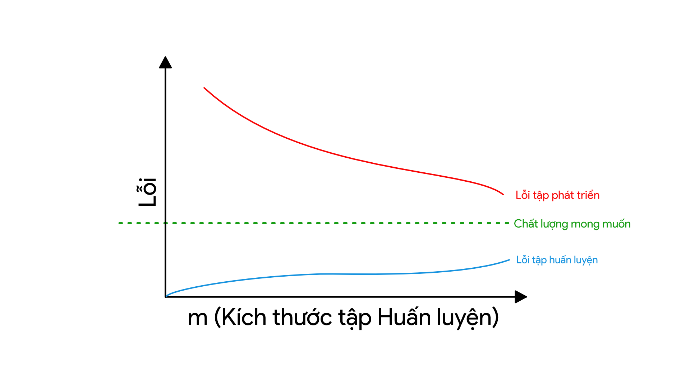

> # 29. Plotting training error

# 29. Vẽ đồ thị sai số huấn luyện

> Your dev set (and test set) error should decrease as the training set size grows. But your training set error usually *increases* as the training set size grows.

Sai số tập phát triển của bạn (và tập kiểm thử) thường giảm khi kích thước tập huấn luyện tăng lên. Nhưng sai số tập huấn luyện của bạn thường xuyên *tăng* khi kích thước tập huấn luyện tăng.

> Let's illustrate this effect with an example. Suppose your training set has only 2 examples: One cat image and one non-cat image. Then it is easy for the learning algorithms to “memorize” both examples in the training set, and get 0% training set error. Even if either or both of the training examples were mislabeled, it is still easy for the algorithm to memorize both labels.

Chúng ta hãy mô tả ảnh hưởng này bằng một ví dụ. Giả sử tập huấn luyện của bạn chỉ 2 gồm mẫu: Một ảnh mèo và một ảnh không phải mèo. Khi đó rất dễ dàng để thuật toán học ghi nhớ cả 2 mẫu trong tập huấn luyện, và nhận 0% sai số huấn luyện. Thậm chí nếu cả 2 mẫu huấn luyện bị gán nhãn sai, vẫn khá dễ dàng cho thuật toán ghi nhớ cả 2 nhãn.

> Now suppose your training set has 100 examples. Perhaps even a few examples are mislabeled, or ambiguous—some images are very blurry, so even humans cannot tell if there is a cat. Perhaps the learning algorithm can still “memorize” most or all of the training set, but it is now harder to obtain 100% accuracy. By increasing the training set from 2 to 100 examples, you will find that the training set accuracy will drop slightly.

Bây giờ giả định tập huấn luyện có 100 mẫu. Thậm chí một vài mẫu bị gán nhãn sai, hoặc một vài hình ảnh là rất mơ hồ do bị mờ, nên ngay cả con người cũng không thể khẳng định đó là một chú mèo. Có lẽ thuật toán học vẫn có thể "ghi nhớ" được hầu hết tập huấn luyện, nhưng nó khó mà đạt được 100% độ chính xác vào lúc này. Bằng cách gia tăng tập huấn luyện từ 2 lên 100 mẫu, bạn sẽ nhận ra rằng độ chính xác của tập huấn luyện sẽ giảm một ít.

> Finally, suppose your training set has 10,000 examples. In this case, it becomes even harder for the algorithm to perfectly fit all 10,000 examples, especially if some are ambiguous or mislabeled. Thus, your learning algorithm will do even worse on this training set.

Cuối cùng, giả sử tập huấn luyện có 10,000 mẫu. Trong trường hợp này, sẽ khó hơn cho thuật toán fit hoàn hảo 10,000 mẫu, đặc biệt là nếu một vài mẫu mơ hồ hoặc bị gán nhãn sai. Do đó, thuật toán học của bạn sẽ hoạt động thậm chí là kém hơn trên tập huấn luyện.

> Let’s add a plot of training error to our earlier figures:

Chúng ta hãy thêm một đồ thị sai số huấn luyện vào các hình trước đó:

> You can see that the blue "training error" curve increases with the size of the training set. Furthermore, your algorithm usually does better on the training set than on the dev set; thus the red dev error curve usually lies strictly above the blue training error curve.

Bạn có thể thấy rằng đồ thị sai số huấn luyện (training error) màu xanh lam tăng theo kích thước của tập huấn luyện. Thêm nữa, thuật toán của bạn thường hoạt động tốt trên tập huấn luyện hơn là tập phát triển; do đó đồ thị sai số tập phát triển hoàn toàn nằm trên đồ thị sai số huấn luyện.

> Let's discuss next how to interpret these plots.

Tiếp theo chúng ta sẽ thảo luận làm thế nào để diễn giải những đồ thị này.
