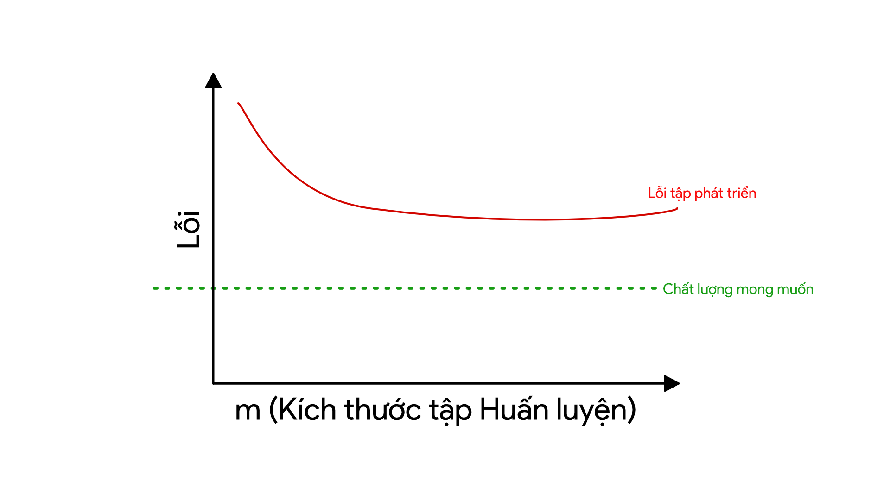
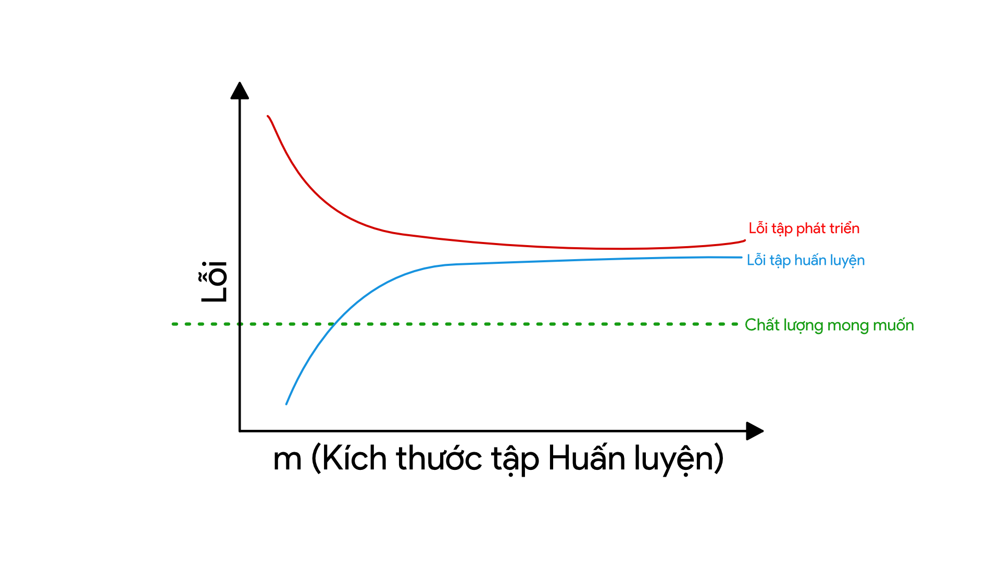

> # 30. Interpreting learning curves: High bias

# 30. Diễn giải đồ thị quá trình học: Độ chệch cao

> Suppose your dev error curve looks like this:

Giả sử đường cong sai số trên tập phát triển có dạng như sau:

> We previously said that, if your dev error curve plateaus, you are unlikely to achieve the desired performance just by adding data.

Như chúng ta đã thảo luận, nếu đường cong sai số trên tập phát triển đi vào trạng thái phẳng và ổn định, việc chỉ thêm dữ liệu sẽ khó có thể đem về hiệu suất ta mong muốn.

> But it is hard to know exactly what an extrapolation of the red dev error curve will look like. If the dev set was small, you would be even less certain because the curves could be noisy.

Tuy nhiên, sẽ thật khó để biết chính xác ngoại suy đường cong thể hiện sai số trên tập phát triển (màu đỏ) sẽ trông như thế nào. Trong trường hợp tập phát triển nhỏ, việc dự đoán chính xác sẽ càng trở nên khó khăn bởi khi đó đường cong này sẽ có khả năng bị nhiễu.

> Suppose we add the training error curve to this plot and get the following:

Giả sử chúng ta thêm đường cong sai số tập huấn luyện vào biểu đồ như hình dưới:

> Now, you can be absolutely sure that adding more data will not, by itself, be sufficient. Why is that? Remember our two observations:

Lúc này, bạn có thể hoàn toàn chắc chắn việc chỉ thêm dữ liệu là không đủ. Tại sao vậy? Hãy nhớ hai nhận định sau:

> * As we add more training data, training error can only get worse. Thus, the blue training error curve can only stay the same or go higher, and thus it can only get further away from the (green line) level of desired performance.

Khi chúng ta thêm dữ liệu huấn luyện, sai số huấn luyện chỉ có thể tăng lên. Vì vậy, đường cong chỉ sai số huấn luyện (màu xanh dương) chỉ có thể giữ nguyên hoặc hướng cao lên. Bởi vậy, đường cong đó chỉ có thể cách xa hơn hiệu suất mong đợi (được thể hiện bởi màu xanh lục).

> * The red dev error curve is usually higher than the blue training error. Thus, there’s almost no way that adding more data would allow the red dev error curve to drop down to the desired level of performance when even the training error is higher than the desired level of performance.

Đường cong thể hiện sai số tập phát triển (màu đỏ) thường cao hơn so với đường cong thể hiện sai số tập huấn luyện (màu xanh). Vì vậy, việc lấy thêm dữ liệu không thể nào giảm đường cong sai số tập phát triển (màu đỏ) xuống mức hiệu xuất mong muốn khi ngay cả sai số trên tập huấn luyện vẫn còn lớn hơn mức đó.

> Examining both the dev error curve and the training error curve on the same plot allows us to more confidently extrapolate the dev error curve.

Đánh giá cả đường cong sai số trên tập phát triển lẫn đường cong sai số trên tập huấn luyện trên cùng một biểu đồ giúp những ngoại suy về đường cong sai số tập phát triển có độ tin cậy cao hơn.

> Suppose, for the sake of discussion, that the desired performance is our estimate of the optimal error rate. The figure above is then the standard "textbook" example of what a learning curve with high avoidable bias looks like: At the largest training set size—presumably corresponding to all the training data we have—there is a large gap between the training error and the desired performance, indicating large avoidable bias. Furthermore, the gap between the training and dev curves is small, indicating small variance.

Cho mục đích thảo luận, giả sử hiệu suất mong muốn chính là ước lượng của tỉ lệ lỗi tối ưu. Đồ thị trên trở thành ví dụ chuẩn "sách giáo khoa" về hình dáng của một đồ thị quá trình học với độ chệch có thể tránh cao: Khi tập huấn luyện có kích cỡ lớn nhất - tương ứng với tất cả dữ liệu trong tập huấn luyện - có một khoảng cách lớn giữa sai số huấn luyện và hiệu suất mong muốn. Đây chính là dấu hiệu của độ chệch có thể tránh cao. Ngược lại, lúc này, khoảng cách nhỏ giữa đường cong của tập huấn luyện và đường cong của tập phát triển tương ứng với phương sai nhỏ.

> Previously, we were measuring training and dev set error only at the rightmost point of this plot, which corresponds to using all the available training data. Plotting the full learning curve gives us a more comprehensive picture of the algorithms’ performance on different training set sizes.

Trước đó, chúng ta chỉ đo sai số tập huấn luyện và sai số tập phát triển tại điểm ngoài cùng bên phải của đồ thị, tương ứng với việc sử dụng tất cả dữ liệu trong tập huấn luyện. Biểu diễn đầy đủ đồ thị quá trình học sẽ cho chúng ta một bức tranh tổng thể hơn về chất lượng của những thuật toán trên các kích cỡ tập huấn luyện khác nhau.
