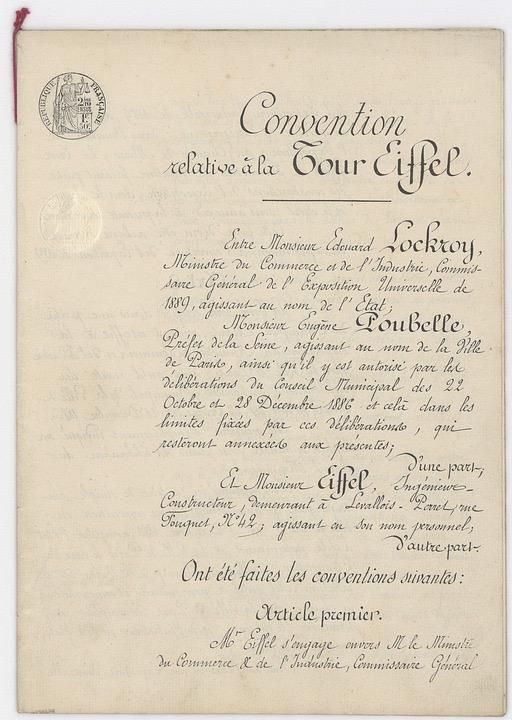

# How to decide whether to use all your data

->

Suppose your cat detector’s training set includes 10,000 user-uploaded images. This data comes from the same distribution as a separate dev/test set, and represents the distribution you care about doing well on. You also have an additional 20,000 images downloaded from the internet. Should you provide all 20,000+10,000=30,000 images to your learning algorithm as its training set, or discard the 20,000 internet images for fear of it biasing your learning algorithm?

->

When using earlier generations of learning algorithms (such as hand-designed computer vision features, followed by a simple linear classifier) there was a real risk that merging both types of data would cause you to perform worse. Thus, some engineers will warn you against including the 20,000 internet images.

->

But in the modern era of powerful, flexible learning algorithms—such as large neural networks—this risk has greatly diminished. If you can afford to build a neural network with a large enough number of hidden units/layers, you can safely add the 20,000 images to your training set. Adding the images is more likely to increase your performance.

->

This observation relies on the fact that there is some x —> y mapping that works well for both types of data. In other words, there exists some system that inputs either an internet image or a mobile app image and reliably predicts the label, even without knowing the source of the image.

->

Adding the additional 20,000 images has the following effects:

->

1. It gives your neural network more examples of what cats do/do not look like. This is helpful, since internet images and user-uploaded mobile app images do share some similarities. Your neural network can apply some of the knowledge acquired from internet images to mobile app images.

->

2. It forces the neural network to expend some of its capacity to learn about properties that are specific to internet images (such as higher resolution, different distributions of how the images are framed, etc.) If these properties differ greatly from mobile app images, it will “use up” some of the representational capacity of the neural network. Thus there is less capacity for recognizing data drawn from the distribution of mobile app images, which is what you really care about. Theoretically, this could hurt your algorithms’ performance.

->

To describe the second effect in different terms, we can turn to the fictional character Sherlock Holmes, who says that your brain is like an attic; it only has a finite amount of space. He says that “for every addition of knowledge, you forget something that you knew before. It is of the highest importance, therefore, not to have useless facts elbowing out the useful ones.” [12]

->

Fortunately, if you have the computational capacity needed to build a big enough neural network—i.e., a big enough attic—then this is not a serious concern. You have enough capacity to learn from both internet and from mobile app images, without the two types of data competing for capacity. Your algorithm’s “brain” is big enough that you don’t have to worry about running out of attic space.

->

But if you do not have a big enough neural network (or another highly flexible learning algorithm), then you should pay more attention to your training data matching your dev/test set distribution.

->

If you think you have data that has no benefit,you should just leave out that data for computational reasons. For example, suppose your dev/test sets contain mainly casual pictures of people, places, landmarks, animals. Suppose you also have a large collection of scanned historical documents:

->

These documents don’t contain anything resembling a cat. They also look completely unlike your dev/test distribution. There is no point including this data as negative examples, because the benefit from the first effect above is negligible—there is almost nothing your neural network can learn from this data that it can apply to your dev/test set distribution. Including them would waste computation resources and representation capacity of the neural network.

->

**FOOTNOTE:**

[12] A Study in Scarlet​ ​by Arthur Conan Doyle

->
