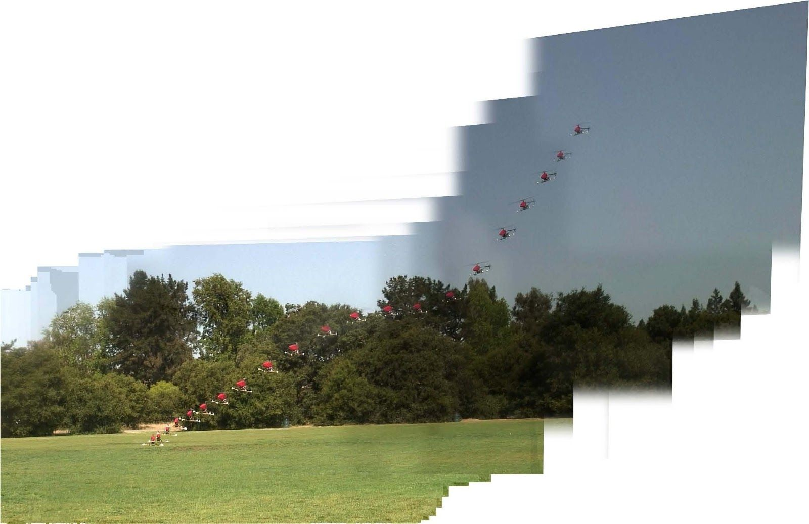

# Reinforcement learning example
->

Suppose you are using machine learning to teach a helicopter to fly complex maneuvers. Here is a time-lapse photo of a computer-controller helicopter executing a landing with the engine turned off.
->

This is called an “autorotation” maneuver. It allows helicopters to land even if their engine unexpectedly fails. Human pilots practice this maneuver as part of their training. Your goal is to use a learning algorithm to fly the helicopter through a trajectory ​*T* t​hat ends in a safe landing.
->

To apply reinforcement learning, you have to develop a “Reward function” ​*R​*(.) that gives a score measuring how good each possible trajectory ​*T​* is. For example, if ​*T* ​results in the helicopter crashing, then perhaps the reward is ​*R(T)​* = -1,000—a huge negative reward. A trajectory ​*T​* resulting in a safe landing might result in a positive ​*R(T)* w​ ith the exact value depending on how smooth the landing was. The reward function ​*R*(​.) is typically chosen by hand to quantify how desirable different trajectories ​*T​* are. It has to trade off how bumpy the landing was, whether the helicopter landed in exactly the desired spot, how rough the ride down was for passengers, and so on. It is not easy to design good reward functions.
->

Given a reward function ​*R(T)*, ​the job of the reinforcement learning algorithm is to control the helicopter so that it achieves max​*T*​*R(T)*. ​However, reinforcement learning algorithms make many approximations and may not succeed in achieving this maximization.
->

Suppose you have picked some reward ​*R(.)​* and have run your learning algorithm. However,
its performance appears far worse than your human pilot—the landings are bumpier and
seem less safe than what a human pilot achieves. How can you tell if the fault is with the
reinforcement learning algorithm—which is trying to carry out a trajectory that achieves
max​*T*​*R(T)*—​ or if the fault is with the reward function—which is trying to measure as well as specify the ideal tradeoff between ride bumpiness and accuracy of landing spot?
->

To apply the Optimization Verification test, let *T*human​ be the trajectory achieved by the human pilot, and let *T*out​ be the trajectory achieved by the algorithm. According to our description above, *T*human​ is a superior trajectory to *T*out​. Thus, the key test is the following:
Does it hold true that *R*(*T*human) > *R*(*T*out​)?
->

