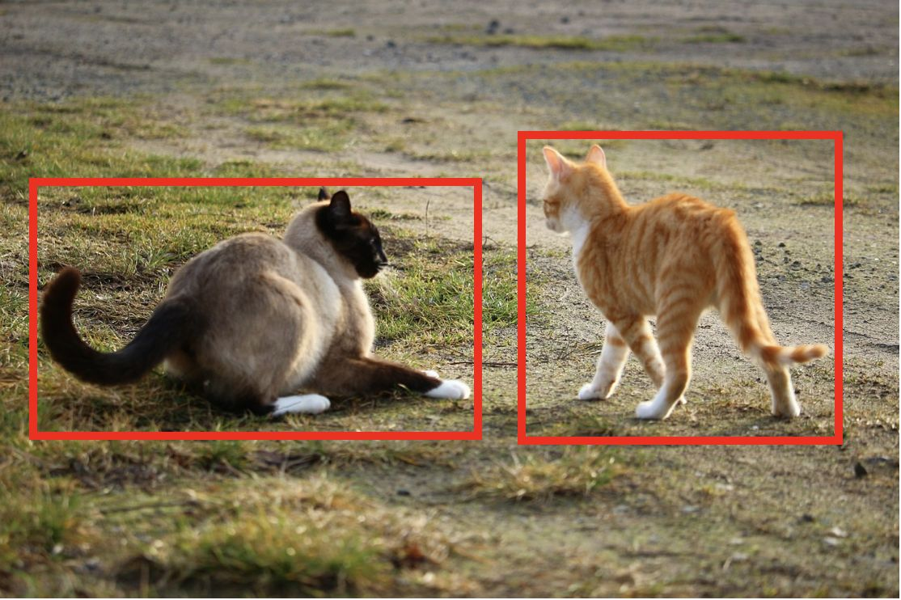

> # 51. Choosing pipeline components: Task simplicity

# 51. Lựa chọn các thành phần cho pipeline: tính đơn giản của tác vụ

> Other than data availability, you should also consider a second factor when picking components of a pipeline: How simple are the tasks solved by the individual components? You should try to choose pipeline components that are individually easy to build or learn. But what does it mean for a component to be "easy" to learn?

Ngoài sự sẵn có của dữ liệu, bạn cũng nên xem xét một nhân tố thứ hai khi lựa chọn các thành phần của một pipeline: Việc giải quyết từng tác vụ bằng các thành phần riêng lẻ đơn giản đến mức nào? Bạn nên cố gắng chọn những thành phần pipeline có thể dễ dàng xây dựng hay học riêng lẻ. Nhưng các thành phần "dễ" học nghĩa là gì?

> Consider these machine learning tasks, listed in order of increasing difficulty:

Xét những tác vụ học máy này, được liệt kê theo thứ tự độ khó tăng dần:

> 1. Classifying whether an image is overexposed (like the example above)

1. Phân loại bức ảnh có bị phơi sáng quá mức hay không (như trong ví dụ trên)

> 2. Classifying whether an image was taken indoor or outdoor

2. Phân loại bức ảnh được chụp trong nhà hay ngoài trời

> 3. Classifying whether an image contains a cat

3. Phân loại bức ảnh có chứa một con mèo hay không

> 4. Classifying whether an image contains a cat with both black and white fur

4. Phân loại bức ảnh có chứa một con mèo khoang đen trắng hay không

> 5. Classifying whether an image contains a Siamese cat (a particular breed of cat)

Phân loại bức ảnh có chứa một con mèo Xiêm (tên một loại mèo) hay không

> Each of these is a binary image classification task: You have to input an image, and output either 0 or 1. But the tasks earlier in the list seem much "easier" for a neural network to learn. You will be able to learn the easier tasks with fewer training examples.

Mỗi tác vụ trên là một bài toán phân loại ảnh nhị phân: Bạn phải có một bức ảnh đầu vào, và cho ra 0 hoặc 1. Nhưng những tác vụ đầu tiên trong danh sách này có vẻ quá "dễ" đối với một mạng nơ-ron. Bạn sẽ có thể huấn luyện những tác vụ dễ hơn với ít mẫu huấn luyện hơn.

> Machine learning does not yet have a good formal definition of what makes a task easy or hard[16]. With the rise of deep learning and multi-layered neural networks, we sometimes say a task is "easy" if it can be carried out with fewer computation steps (corresponding to a shallow neural network), and "hard" if it requires more computation steps (requiring a deeper neural network). But these are informal definitions.

Học máy chưa có một định nghĩa chính thức nào về một tác vụ là dễ hay khó[16]. Với sự phát triển của học sâu và mạng neural đa tầng, chúng ta nói một tác vụ là "dễ" nếu có có thể được thực hiện với ít bước tính toán hơn (ứng với mạng nơ-ron nông), và "khó" nếu nó đòi hỏi nhiều bước tính toán hơn (đòi hỏi một mạng nơ-ron sâu hơn). Nhưng đây đều là các định nghĩa không chính thức.

> If you are able to take a complex task, and break it down into simpler sub-tasks, then by coding in the steps of the sub-tasks explicitly, you are giving the algorithm prior knowledge that can help it learn a task more efficiently.

Nếu bạn có thể lấy một tác vụ phức tạp, và chia nhỏ nó thành những tác vụ con đơn giản hơn, sau đó viết mã nguồn cụ thể cho từng tác vụ con, bạn đang cung cấp cho thuật toán một tri thức tiền đề giúp nó học một tác vụ hiệu quả hơn.

> Suppose you are building a Siamese cat detector. This is the pure end-to-end architecture:

Giả sử bạn đang xây dựng bộ phát hiện một con mèo Xiêm. Dưới đây là một kiến trúc thuần đầu-cuối:

> In contrast, you can alternatively use a pipeline with two steps:

Ngược lại, bọn cũng có thể sử dụng một pipeline với hai bước:

> The first step (cat detector) detects all the cats in the image.

Bước đầu tiên (bộ phát hiện mèo) xác định tất cả con mèo trong bức ảnh.

> The second step then passes cropped images of each of the detected cats (one at a time) to a cat species classifier, and finally outputs 1 if any of the cats detected is a Siamese cat.

Bước thứ hai đưa những bức ảnh được cắt ra từ bộ phát hiện mèo (từng bức một) vào bộ phân loại mèo, và cuối cùng đưa ra 1 nếu bất kỳ ảnh cắt ra được xác định là một con mèo Xiêm.

> Compared to training a purely end-to-end classifier using just labels 0/1, each of the two components in the pipeline -- the cat detector and the cat breed classifier -- seem much easier to learn and will require significantly less data[17].

So với việc huấn luyện bộ phân loại thuần đầu-cuối chỉ sử dụng nhãn 0/1, mỗi trong hai thành phần trong pipeline -- bộ phát hiện mèo và bộ phân loại mèo -- có vẻ dễ hơn nhiều để học và đòi hỏi lượng dữ liệu ít hơn[17].

> As one final example, let’s revisit the autonomous driving pipeline.

Ví dụ cuối cùng, cùng nhìn lại pipeline xe tự lái:

> By using this pipeline, you are telling the algorithm that there are 3 key steps to driving: (1) Detect other cars, (2) Detect pedestrians, and (3) Plan a path for your car. Further, each of these is a relatively simpler function -- and can thus be learned with less data -- than the purely end-to-end approach.

Bằng cách sử dụng pipeline này, bạn đang nói với thuật toán rằng có 3 bước chính để lái xe: (1) Phát hiện những chiếc xe hơi khác, (2) Phát hiện người đi bộ, và (3) Hoạch định đường đi cho xe của bạn. Ngoài ra, mỗi bước này là một hàm số tương đối đơn giản hơn -- và có thể được học với ít dữ liệu hơn -- so với hướng tiếp cận thuần đầu-cuối.

> In summary, when deciding what should be the components of a pipeline, try to build a pipeline where each component is a relatively "simple" function that can therefore be learned from only a modest amount of data.

Tóm lại, khi lựa chọn các thành phần cho một pipeline, hãy cố gắng xây dựng một pipeline mà mỗi thành phần là một hàm số tương đối "đơn giản" sao cho nó có thể học được từ chỉ một lượng dữ liệu vừa phải.

> **FOOTNOTE:**

**CHÚ THÍCH:**

> [16] Information theory has the concept of "Kolmogorov Complexity", which says that the complexity of a learned function is the length of the shortest computer program that can produce that function. However, this theoretical concept has found few practical applications in AI. See also: https://en.wikipedia.org/wiki/Kolmogorov_complexity

[16] Lý thuyết thông tin có khái niệm về "Độ phức tạp Kolmogorov", lý thuyết này nói rằng độ phức tạp của hàm số học được là độ dài của chương trình máy tính ngắn nhất để có thể xây dựng thuật toán đó. Tuy nhiên, khái niệm lý thuyết này ít có ứng dụng thực tế trong AI. Xem thêm https://en.wikipedia.org/wiki/Kolmogorov_complexity

> [17] If you are familiar with practical object detection algorithms, you will recognize that they do not learn just with 0/1 image labels, but are instead trained with bounding boxes provided as part of the training data. A discussion of them is beyond the scope of this chapter. See the Deep Learning specialization on Coursera (http://deeplearning.ai) if you would like to learn more about such algorithms.

[17] Nếu bạn quen với các thuật toán thực tế về phát hiện vật thể, bạn sẽ nhận ra rằng chúng không chỉ học với ảnh có nhãn 0/1, và thay vào đó được huấn luyện với các khung chứa từ dữ liệu huấn luyện. Thảo luận về vấn đề này nằm ngoài phạm vi của chương này. Tham khảo khóa "Deep Learning specialization" trên Coursera (http://deeplearning.ai) nếu bạn muốn học thêm về thuật toán này.
