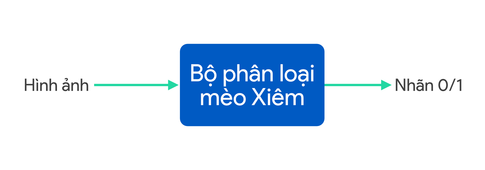
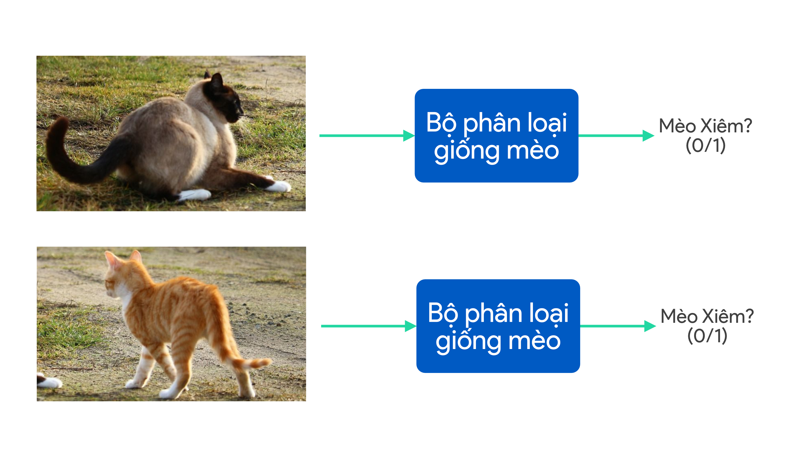

> # 51. Choosing pipeline components: Task simplicity

--> _replace THIS LINE by your translation for the above line_

> Other than data availability, you should also consider a second factor when picking components of a pipeline: How simple are the tasks solved by the individual components? You should try to choose pipeline components that are individually easy to build or learn. But what does it mean for a component to be "easy" to learn?

--> _replace THIS LINE by your translation for the above line_

> Consider these machine learning tasks, listed in order of increasing difficulty:

--> _replace THIS LINE by your translation for the above line_

> 1. Classifying whether an image is overexposed (like the example above)

--> _replace THIS LINE by your translation for the above line_

> 2. Classifying whether an image was taken indoor or outdoor

--> _replace THIS LINE by your translation for the above line_

> 3. Classifying whether an image contains a cat

--> _replace THIS LINE by your translation for the above line_

> 4. Classifying whether an image contains a cat with both black and white fur

--> _replace THIS LINE by your translation for the above line_

> 5. Classifying whether an image contains a Siamese cat (a particular breed of cat)

--> _replace THIS LINE by your translation for the above line_

> Each of these is a binary image classification task: You have to input an image, and output either 0 or 1. But the tasks earlier in the list seem much "easier" for a neural network to learn. You will be able to learn the easier tasks with fewer training examples.

--> _replace THIS LINE by your translation for the above line_

> Machine learning does not yet have a good formal definition of what makes a task easy or hard.[16] With the rise of deep learning and multi-layered neural networks, we sometimes say a task is "easy" if it can be carried out with fewer computation steps (corresponding to a shallow neural network), and "hard" if it requires more computation steps (requiring a deeper neural network). But these are informal definitions.

--> _replace THIS LINE by your translation for the above line_

> If you are able to take a complex task, and break it down into simpler sub-tasks, then by coding in the steps of the sub-tasks explicitly, you are giving the algorithm prior knowledge that can help it learn a task more efficiently.

--> _replace THIS LINE by your translation for the above line_

> Suppose you are building a Siamese cat detector. This is the pure end-to-end architecture:

--> _replace THIS LINE by your translation for the above line_

> In contrast, you can alternatively use a pipeline with two steps:

--> _replace THIS LINE by your translation for the above line_

> The first step (cat detector) detects all the cats in the image.

--> _replace THIS LINE by your translation for the above line_

> The second step then passes cropped images of each of the detected cats (one at a time) to a cat species classifier, and finally outputs 1 if any of the cats detected is a Siamese cat.

--> _replace THIS LINE by your translation for the above line_

> Compared to training a purely end-to-end classifier using just labels 0/1, each of the two components in the pipeline--the cat detector and the cat breed classifier--seem much easier to learn and will require significantly less data.[17]

--> _replace THIS LINE by your translation for the above line_

> As one final example, let’s revisit the autonomous driving pipeline.

--> _replace THIS LINE by your translation for the above line_

> By using this pipeline, you are telling the algorithm that there are 3 key steps to driving: (1) Detect other cars, (2) Detect pedestrians, and (3) Plan a path for your car. Further, each of these is a relatively simpler function--and can thus be learned with less data--than the purely end-to-end approach.

--> _replace THIS LINE by your translation for the above line_

> In summary, when deciding what should be the components of a pipeline, try to build a pipeline where each component is a relatively "simple" function that can therefore be learned from only a modest amount of data.

--> _replace THIS LINE by your translation for the above line_

> **FOOTNOTE:**

> [16] Information theory has the concept of "Kolmogorov Complexity", which says that the complexity of a learned function is the length of the shortest computer program that can produce that function. However, this theoretical concept has found few practical applications in AI. See also: https://en.wikipedia.org/wiki/Kolmogorov_complexity

--> _replace THIS LINE by your translation for the above line_

> [17] If you are familiar with practical object detection algorithms, you will recognize that they do not learn just with 0/1 image labels, but are instead trained with bounding boxes provided as part of the training data. A discussion of them is beyond the scope of this chapter. See the Deep Learning specialization on Coursera (​http://deeplearning.ai​) if you would like to learn more about such algorithms.

--> _replace THIS LINE by your translation for the above line_
