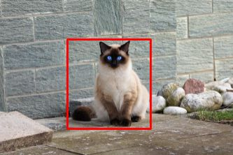

> # 53. Error analysis by parts

--> _replace THIS LINE by your translation for the above line_

> Suppose your system is built using a complex machine learning pipeline, and you would like to improve the system’s performance. Which part of the pipeline should you work on improving? By attributing errors to specific parts of the pipeline, you can decide how to prioritize your work.

--> _replace THIS LINE by your translation for the above line_

> Let’s use our Siamese cat classifier example:

--> _replace THIS LINE by your translation for the above line_

> The first part, the cat detector, detects cats and crops them out of the image. The second part, the cat breed classifier, decides if it is a Siamese cat. It is possible to spend years working on improving either of these two pipeline components. How do you decide which component(s) to focus on?

--> _replace THIS LINE by your translation for the above line_

> By carrying out ​**error analysis by parts​**, you can try to attribute each mistake the algorithm makes to one (or sometimes both) of the two parts of the pipeline. For example, the algorithm misclassifies this image as not containing a Siamese cat (y=0) even though the correct label is y=1.

--> _replace THIS LINE by your translation for the above line_

> Let’s manually examine what the two steps of the algorithm did. Suppose the Siamese cat detector had detected a cat as follows:

--> _replace THIS LINE by your translation for the above line_

> This means that the cat breed classifier is given the following image:

--> _replace THIS LINE by your translation for the above line_

> The cat breed classifier then correctly classifies this image as not containing a Siamese cat. Thus, the cat breed classifier is blameless: It was given of a pile of rocks and outputted a very reasonable label y=0. Indeed, a human classifying the cropped image above would also have predicted y=0. Thus, you can clearly attribute this error to the cat detector.

--> _replace THIS LINE by your translation for the above line_

> If, on the other hand, the cat detector had outputted the following bounding box:

--> _replace THIS LINE by your translation for the above line_

> then you would conclude that the cat detector had done its job, and that it was the cat breed classifier that is at fault.

--> _replace THIS LINE by your translation for the above line_

> Say you go through 100 misclassified dev set images and find that 90 of the errors are attributable to the cat detector, and only 10 errors are attributable to the cat breed classifier. You can safely conclude that you should focus more attention on improving the cat detector.

--> _replace THIS LINE by your translation for the above line_

> Further, you have now also conveniently found 90 examples where the cat detector outputted incorrect bounding boxes. You can use these 90 examples to carry out a deeper level of error analysis on the cat detector to see how to improve that.

--> _replace THIS LINE by your translation for the above line_

> Our description of how you attribute error to one part of the pipeline has been informal so far: you look at the output of each of the parts and see if you can decide which one made a mistake. This informal method could be all you need. But in the next chapter, you’ll also see a more formal way of attributing error.

--> _replace THIS LINE by your translation for the above line_
