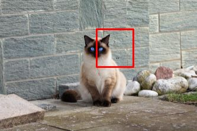

> # 54. Attributing error to one part

--> _replace THIS LINE by your translation for the above line_

> Let’s continue to use this example:

--> _replace THIS LINE by your translation for the above line_

> Suppose the cat detector outputted this bounding box:

--> _replace THIS LINE by your translation for the above line_

> The cat breed classifier is thus given this cropped image, whereupon it incorrectly outputs y=0, or that there is no cat in the picture.

--> _replace THIS LINE by your translation for the above line_

> The cat detector did its job poorly. However, a highly skilled human could arguably still recognize the Siamese cat from the poorly cropped image. So do we attribute this error to the cat detector, or the cat breed classifier, or both? It is ambiguous.

--> _replace THIS LINE by your translation for the above line_

> If the number of ambiguous cases like these is small, you can make whatever decision you want and get a similar result. But here is a more formal test that lets you more definitively attribute the error to exactly one part:

--> _replace THIS LINE by your translation for the above line_

> 1. Replace the cat detector output with a hand-labeled bounding box.

--> _replace THIS LINE by your translation for the above line_

> 2. Run the corresponding cropped image through the cat breed classifier. If the cat breed classifier still misclassifies it, attribute the error to the cat breed classifier. Otherwise, attribute the error to the cat detector.

--> _replace THIS LINE by your translation for the above line_

> In other words, run an experiment in which you give the cat breed classifier a “perfect” input. There are two cases:

--> _replace THIS LINE by your translation for the above line_

> * Case 1: Even given a “perfect” bounding box, the cat breed classifier still incorrectly outputs y=0. In this case, clearly the cat breed classifier is at fault.

--> _replace THIS LINE by your translation for the above line_

> * Case 2: Given a “perfect” bounding box, the breed classifier now correctly outputs y=1. This shows that if only the cat detector had given a more perfect bounding box, then the overall system’s output would have been correct. Thus, attribute the error to the cat detector.

--> _replace THIS LINE by your translation for the above line_

> By carrying out this analysis on the misclassified dev set images, you can now unambiguously attribute each error to one component. This allows you to estimate the fraction of errors due to each component of the pipeline, and therefore decide where to focus your attention.

--> _replace THIS LINE by your translation for the above line_
