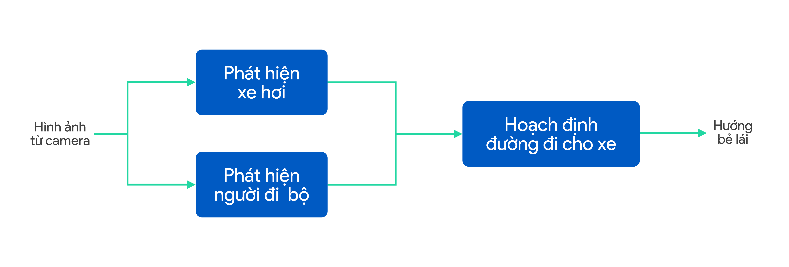

> # 57. Spotting a flawed ML pipeline

--> _replace THIS LINE by your translation for the above line_

> What if each individual component of your ML pipeline is performing at human-level performance or near-human-level performance, but the overall pipeline falls far short of human-level? This usually means that the pipeline is flawed and needs to be redesigned. Error analysis can also help you understand if you need to redesign your pipeline.

--> _replace THIS LINE by your translation for the above line_

> In the previous chapter, we posed the question of whether each of the three components’ performance is at human level. Suppose the answer to all three questions is yes. That is:

--> _replace THIS LINE by your translation for the above line_

> 1. The Detect cars component is at (roughly) human-level performance for detecting cars from the camera images.

--> _replace THIS LINE by your translation for the above line_

> 2. The Detect pedestrians component is at (roughly) human-level performance for detecting cars from the camera images.

--> _replace THIS LINE by your translation for the above line_

> 3. *Compared to a human that has to plan a path for the car given only the outputs from the previous two pipeline components (rather than access to the camera images)*,​ the Plan path component’s performance is at a similar level.

--> _replace THIS LINE by your translation for the above line_

> However, your overall self-driving car is performing significantly below human-level performance. I.e., humans given access to the camera images can plan significantly better paths for the car. What conclusion can you draw?

--> _replace THIS LINE by your translation for the above line_

> The only possible conclusion is that the ML pipeline is flawed. In this case, the Plan path component is doing as well as it can ​*given its inputs*,​ but the inputs do not contain enough information. You should ask yourself what other information, other than the outputs from the two earlier pipeline components, is needed to plan paths very well for a car to drive. In other words, what other information does a skilled human driver need?

--> _replace THIS LINE by your translation for the above line_

> For example, suppose you realize that a human driver also needs to know the location of the lane markings. This suggests that you should redesign the pipeline as follows:[18]

--> _replace THIS LINE by your translation for the above line_

> Ultimately, if you don’t think your pipeline as a whole will achieve human-level performance, even if every individual component has human-level performance (remember that you are comparing to a human who is given the same input as the component), then the pipeline is flawed and should be redesigned.

--> _replace THIS LINE by your translation for the above line_

> **FOOTNOTE:**

> [18] In the self-driving example above, in theory one could solve this problem by also feeding the raw camera image into the planning component. However, this would violate the design principle of “Task simplicity” described in Chapter 51, because the path planning module now needs to input a raw image and has a very complex task to solve. That’s why adding a Detect lane markings component is a better choice--it helps get the important and previously missing information about lane markings to the path planning module, but you avoid making any particular module overly complex to build/train.

--> _replace THIS LINE by your translation for the above line_
